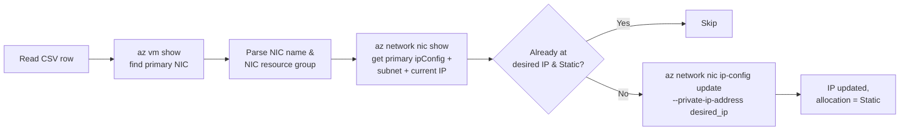

<div align="center">

# 🌐 az-script-ChangeIP

**Bulk-reassign the primary private IP of Azure VMs from a CSV file — powered by the Azure CLI.**

[](https://learn.microsoft.com/cli/azure/)
[](https://www.gnu.org/software/bash/)
[](LICENSE)
[]()

</div>

---

## ✨ What it does

Give it a CSV with **VM name**, **resource group**, and the **desired IP**, and it will:

1. 🔎 Locate the **primary NIC** of each VM.
2. 🎯 Find its **primary `ipConfiguration`**.
3. 🔁 Update the private IP to the value you provided and switch the allocation to **`Static`**.
4. 🛡️ Keep the existing **subnet, public IP, NSG, ASGs and secondary IP configs** untouched.
5. ✅ Skip rows that are already correct (fully idempotent).

> 💡 **No VM reboot required.** Azure reprograms the NIC live and the guest OS picks up the new IP via DHCP (Azure VMs always use DHCP in-guest, even for "Static" allocations).

---

## 📦 Repository layout

| File | Purpose |
| --- | --- |
| [`set-vm-static-ip.sh`](set-vm-static-ip.sh) | The script. |
| [`vms.csv`](vms.csv) | CSV template / example input. |
| [`README.md`](README.md) | This file. |
| [`LICENSE`](LICENSE) | MIT license. |

---

## 📝 CSV format

```csv
vm_name,resource_group,desired_ip
vm-app-01,rg-prod-app,10.0.0.10
vm-app-02,rg-prod-app,10.0.0.11
```

| Column | Description |
| --- | --- |
| `vm_name` | VM name in Azure. |
| `resource_group` | Resource group of the **VM** (the NIC may live in a different RG — the script handles that). |
| `desired_ip` | Private IPv4 to assign. **Must be inside the subnet currently attached to the primary NIC.** |

✔️ UTF-8 BOM is stripped.  
✔️ Windows `CRLF` line endings are tolerated.  
✔️ Blank lines are ignored.

---

## 🚀 Quick start

```bash
# 1. Clone
git clone https://github.com/numaneto/az-script-ChangeIP.git
cd az-script-ChangeIP

# 2. Log in and pick the subscription
az login
az account set --subscription "<your-subscription-id>"

# 3. Edit vms.csv with your data
$EDITOR vms.csv

# 4. Preview (no changes made)
./set-vm-static-ip.sh vms.csv --dry-run

# 5. Apply
./set-vm-static-ip.sh vms.csv
```

---

## 🧰 Prerequisites

- **Azure CLI** (`az`) — [install guide](https://learn.microsoft.com/cli/azure/install-azure-cli)
- **Bash** ≥ 4
- **python3** — used only to parse small JSON payloads
- **Permissions:** `Network Contributor` (or equivalent) on the target NICs
- An authenticated session: `az login`

---

## 🔬 How it works, per CSV row



Under the hood, the actual update call boils down to:

```bash
az network nic ip-config update \
    --resource-group "<nic-rg>" \
    --nic-name       "<nic-name>" \
    --name           "<primary-ipconfig-name>" \
    --private-ip-address "<desired-ip>"
```

Passing `--private-ip-address` automatically flips the allocation method from `Dynamic` to `Static` and **does not** touch the subnet, public IP, NSG, ASGs, or any secondary ipConfigurations.

---

## 🧪 Sample output

```text
----------------------------------------------------------------
VM:           vm-app-01
Resource grp: rg-prod-app
Desired IP:   10.0.0.10
  NIC:          vm-app-01-nic (rg: rg-prod-app)
  ipConfig:     ipconfig1
  Current IP:   10.0.0.47 (Dynamic)
  Subnet:       /subscriptions/.../subnets/snet-app
  [DONE] vm-app-01-nic/ipconfig1 -> 10.0.0.10 (Static).
----------------------------------------------------------------
VM:           vm-app-02
Resource grp: rg-prod-app
Desired IP:   10.0.0.11
  NIC:          vm-app-02-nic (rg: rg-prod-app)
  ipConfig:     ipconfig1
  Current IP:   10.0.0.11 (Static)
  Subnet:       /subscriptions/.../subnets/snet-app
  [OK] Already set to 10.0.0.11 (Static). Skipping.
----------------------------------------------------------------
Finished.
```

---

## ⚠️ Important notes

- 🔌 **Existing TCP sessions** on the old IP will drop the moment the NIC is reprogrammed.
- 📐 The IP **must belong to the existing subnet** — the script does **not** move VMs between subnets.
- 🚫 Avoid Azure's **reserved addresses**: the first 4 IPs and the last IP of every subnet.
- 🧩 VMs with **multiple NICs** → only the NIC flagged as `primary` is changed.
- 🧩 NICs with **multiple ipConfigurations** → only the one flagged as `primary` is changed.
- 🔁 **Idempotent** — safe to re-run.

---

## 🩺 Troubleshooting

| Error | Likely cause |
| --- | --- |
| `VM not found or has no NIC` | Wrong `vm_name` / `resource_group`, or wrong subscription selected. |
| `PrivateIPAddressIsBeingUsed` | Another NIC in the subnet already holds that IP. |
| `PrivateIPAddressNotInSubnet` | `desired_ip` is outside the subnet CIDR currently attached to the primary NIC. |
| `AuthorizationFailed` | The signed-in principal lacks `Network Contributor` on the NIC. |

---

## 📄 License

Released under the [MIT License](LICENSE).

---

<div align="center">

Made with ☕ and ⚡ for Azure operators who hate clicking through the portal.

</div>
